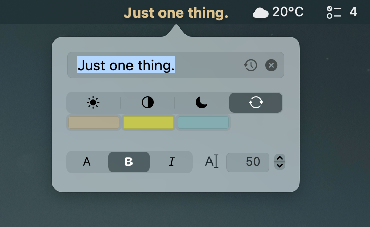
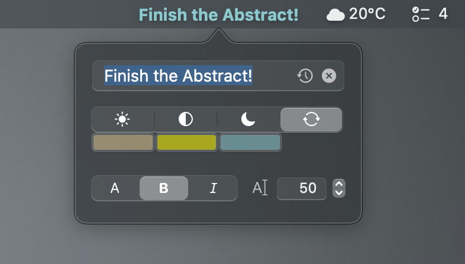

# 1thing 1.9 "Taarnet"

A lightweight, native macOS menu bar app that keeps one thing visible at all times.

 

## Features

- Compact native macOS popover
- Return saves; Escape closes without saving
- Inline History and Clear buttons with subtle hover feedback
- History menu with the ten most recent entries
- Up/Down arrow navigation through the complete history
- Automatic text color or three custom color profiles
- Quick color-profile switching from the menu bar context menu
- Normal, Bold, and Italic menu bar text styles
- Configurable character limit
- History stored in `~/.config/1thing/history.txt`
- Shift-click shortcut to clear the saved text immediately
- Launch at login through `SMAppService`
- Native Edit menu shortcuts and `⌘Q`
- App icon and native About dialog
- No Dock icon, analytics, account, or network access

## Color profiles

Dynamic wallpapers can make a single accent color difficult to read throughout the day. 1thing provides four text-color modes:

- **Automatic** — uses the Light profile in Light Mode and the Dark profile in Dark Mode
- **Light** — custom color for Light Mode and bright wallpaper states
- **Mixed** — custom color for transitional or visually mixed states
- **Dark** — custom color for dark wallpaper states

The dropdown and right-click menu use SF Symbols to distinguish the modes. Right-click the menu bar item to switch profiles immediately.

## Text styles

Choose one of three menu bar text styles:

- **Normal** — the established semibold 1thing appearance
- **Bold** — a stronger emphasis
- **Italic** — a slanted variant of the normal weight

The active style is marked with a checkmark in the dropdown menu.

## History

Saved entries are stored as UTF-8 text with one entry per line:

```text
~/.config/1thing/history.txt
```

The newest entry appears first. Reusing an existing entry moves it to the top.

Use `↑` and `↓` in the input field to browse the complete history, or click the inline history icon to choose from the ten most recent entries. Selecting an entry fills the editor; it is not saved until Return is pressed. Choose **Open History File…** to open the complete UTF-8 history in the default text editor.

## Requirements

- macOS 13 or later
- Apple Silicon Mac
- Swift compiler / Xcode Command Line Tools

## Build

```zsh
./build.zsh
```

The build script uses `APPLE_SIGN_IDENTITY` from `~/.toolbox` when available. Without it, the app receives an ad-hoc signature.

## Controls

| Action | Result |
|---|---|
| Left-click | Open or close the editor |
| Right-click | Open the color-profile menu |
| Shift-click | Clear the saved text immediately |
| Inline History | Show the ten most recent entries |
| Inline × | Clear the current input |
| Return | Save and close |
| `↑` / `↓` | Browse the complete history |
| Escape | Close without saving |
| `⌘C`, `⌘X`, `⌘V`, `⌘A`, `⌘Z` | Standard editing actions |
| `⌘Q` | Quit |

## Privacy

1thing stores its settings and history locally. It makes no network requests and collects no data.

## Author

Created by [Steffen Wöll](https://steffenwoell.github.io), 2026.

## License

MIT License.
